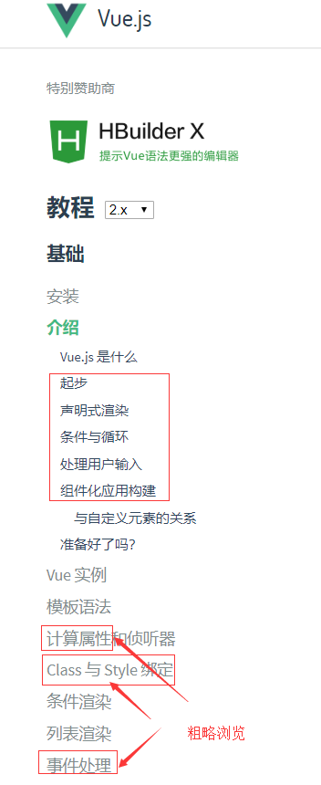

## 入门重点
官网 https://cn.vuejs.org/v2/guide/    目前是v2版本
建议：不是专业前端不要花费过多时间，教程不用挨着看，重点部分跟着敲并运行出效果。
### 文档重点阅读
作为后端不用从头自习学习vue全部内容，参考
  
快速浏览。然后直接开始实战项目，在实战项目时就会理解了。

重点部分目录：
1. 基础/介绍
2. Vue实例
3.  计算属性
4. 条件渲染 事件处理
5. 表单输入绑定

新概念：
1. 数值绑定。 vue神奇好用的核心功能。data改变，值局部异步刷新。
2. 生命周期。 vue实例create时往往会调用方法请求后端获取数据。
3. 单文件组件。 vue实例对象可以重用。为了工程化将html js css写在一个文件中。

## 生态
vue.js
vuex       状态管理。为了避免前端项目变大后值管理混乱。适合大型项目。
vue-router      路由插件。类似django url.py
axios       http请求库。类似python中 grequests
devtools    谷歌vue调试插件。
vue-cli     初始化项目。类似python django中django-admin

## (练习)运行一个前端项目
2. vue仿网易云 https://github.com/javaSwing/NeteaseCloudWebApp
3. nodebb 基于nodejs开发的体验优秀的论坛 https://github.com/NodeBB/NodeBB
